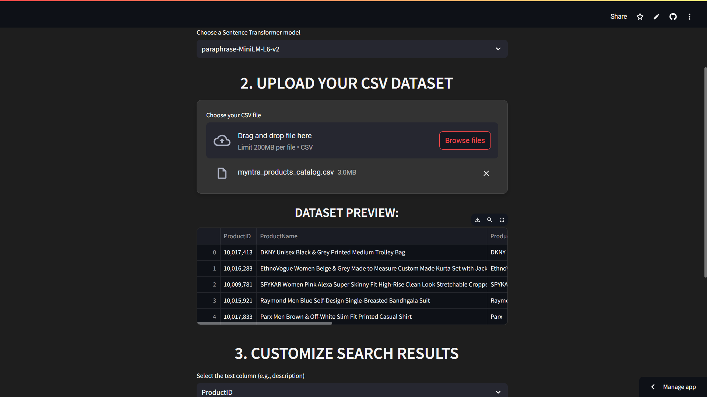
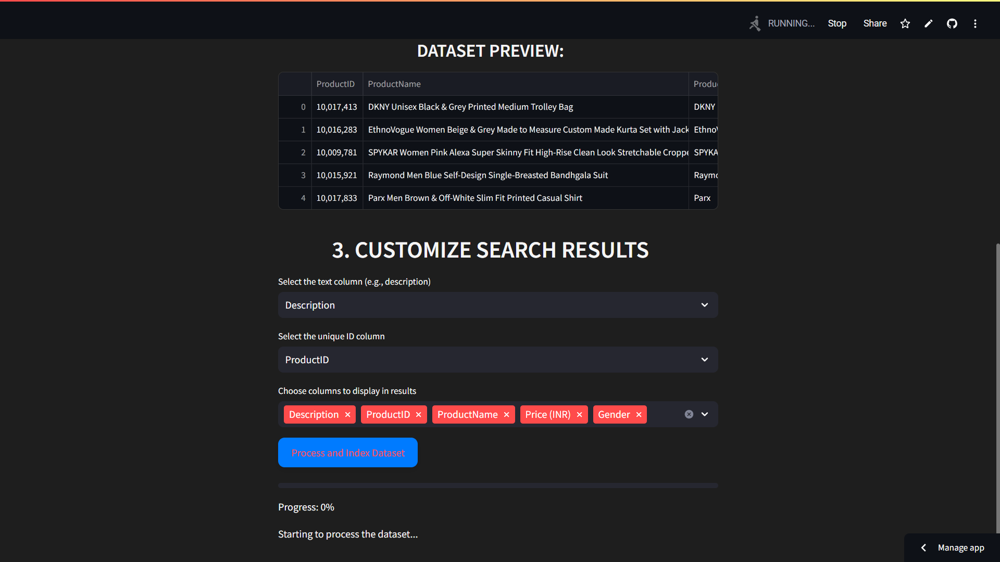

<div align="center">

# Semantica - A Semantic Search Engine
Semantica is a cutting-edge semantic search engine built using Streamlit, Elasticsearch, and Sentence Transformers. It allows users to perform context-aware searches by leveraging vector embeddings and k-Nearest Neighbors (kNN) search capabilities. Designed for developers and researchers, Semantica provides a user-friendly interface for dataset ingestion, embedding generation, and semantic search.


</div>

---

## **Features**
- **Dataset Upload**: Upload CSV files with text and metadata for processing.
- **Model Selection**: Choose from pre-trained Sentence Transformer models for embedding generation.
- **Vector Embedding**: Transform text data into dense vector embeddings to capture semantic meaning.
- **Indexing**: Efficiently store data in Elasticsearch for fast retrieval.
- **Semantic Search**: Perform context-aware queries using vector similarity.
- **Result Export**: Export search results in CSV, Excel, or PDF formats.
- **Customizable UI**: Dark-themed, modern UI with user-friendly controls.

---

## **Architecture**

1. **Frontend**:
   - Built with Streamlit for interactivity.
   - Enables dataset upload, model selection, and query submission.

2. **Backend**:
   - Elasticsearch for data storage and kNN-based similarity search.

3. **Machine Learning**:
   - Sentence Transformers for generating vector embeddings from text data.

4. **Data Handling**:
   - Pandas for preprocessing and managing uploaded datasets.

---

## **Workflow**
1. **Upload Dataset**:
   - Upload a CSV file containing text data and metadata.
   - Preview the uploaded dataset in the app.

2. **Model Selection**:
   - Select a Sentence Transformer model (e.g., `paraphrase-MiniLM-L6-v2`, `all-mpnet-base-v2`).

3. **Embedding and Indexing**:
   - Generate embeddings for the selected text column.
   - Index the data into Elasticsearch, including metadata and dense vectors.

4. **Search and Retrieve**:
   - Enter a search query, which is transformed into a vector.
   - Retrieve the top results based on vector similarity using kNN search.

5. **Export Results**:
   - Download search results in CSV, Excel, or PDF formats.

---

## **Project Structure**
```
Semantica/
├── app.py                  # Main application script for Streamlit.
├── custom.css             # Custom CSS file for styling the app.
├── report_generator.py    # Script for exporting results in various formats.
├── requirements.txt       # List of dependencies for the project.
├── .env                  # Environment variables (optional, for local use).
└── elasticsearch.yml      # Elasticsearch configuration (if self-hosted).
```
---
## **Screenshots**


### **1. Home Page**


### **2. Dataset Preview**


### **3. Search Results Customisation**


<!-- 
### **2. Search Results**


--- -->


---

## **Setup and Installation**

### **Prerequisites**
- Python 3.7 or higher
- Elasticsearch (local or cloud-hosted)
- Virtual Environment (recommended)

### **1. Clone the Repository**
```bash
git clone https://github.com/Milind-Palaria/Semantica---A-Semantic-Search-Engine.git
cd semantica
```

### **2. Set Up a Virtual Environment**
```bash
python -m venv sementicaVENV
source sementicaVENV/bin/activate    # For Linux/Mac
sementicaVENV\Scripts\activate     # For Windows
```

### **3. Install Dependencies**
```bash
pip install -r requirements.txt
```

### **4. Configure Elasticsearch**
- **Option 1: Elastic Cloud**
  - Sign up at [Elastic Cloud](https://cloud.elastic.co/).
  - Obtain the `ES_ENDPOINT`, `ES_USERNAME`, and `ES_PASSWORD`.

- **Option 2: Local Elasticsearch**
  - Install Elasticsearch locally.
  - Run it with Docker:
    ```bash
    docker run -d --name elasticsearch -p 9200:9200 -e "discovery.type=single-node" docker.elastic.co/elasticsearch/elasticsearch:8.10.2
    ```

### **5. Configure Environment Variables**
- Create a `.env` file:
  ```plaintext
  ES_ENDPOINT=https://your-elasticsearch-endpoint
  ES_USERNAME=elastic
  ES_PASSWORD=your-password
  ```

### **6. Run the Application**
```bash
streamlit run app.py
```
- Access the app locally at `http://localhost:8501`.

---

## **How to Use**

### **Step 1: Connect to Elasticsearch**
- Ensure Elasticsearch is running and accessible.
- The app will notify you if the connection is successful.

### **Step 2: Upload Your Dataset**
- Upload a CSV file with at least one text column.
- Preview the dataset and select the relevant columns for processing.

### **Step 3: Process and Index Data**
- Select a pre-trained Sentence Transformer model.
- Click the **"Process and Index Dataset"** button to generate embeddings and store the data.

### **Step 4: Perform a Search**
- Enter a search query in plain text.
- View the top results ranked by semantic similarity.

### **Step 5: Export Results**
- Download the search results as CSV, Excel, or PDF files.

---

## **Contributing**

Contributions are welcome! To contribute:
1. Fork the repository.
2. Create a feature branch.
3. Commit your changes.
4. Submit a pull request.

---

## **License**
This project is licensed under the MIT License. See the LICENSE file for details.

---

## **Contact**
- **Author**: Milind Palaria
- **Email**: palaria23@gmail.com
- **GitHub**: [https://github.com/Milind-Palaria](https://github.com/Milind-Palaria)

